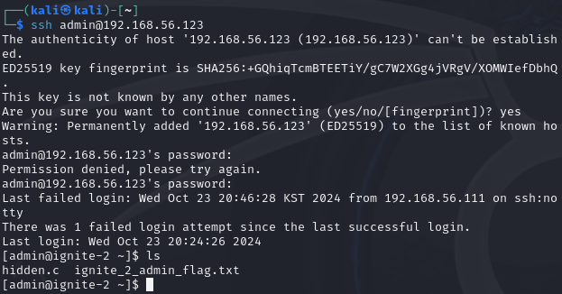
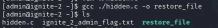
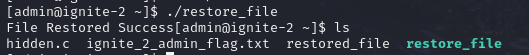
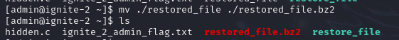
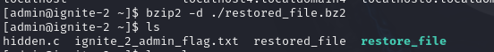
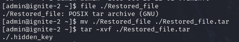
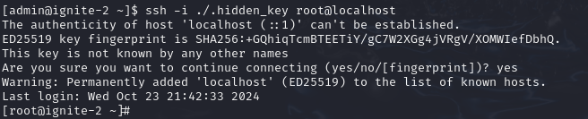

## To do!  
adminDB.linuxusers password 바꾸기  
network auto 설정  
  
---  
DB  
	admin - adminPAssWOrd  
	JY - jyPAssWOrd  
	MJ - mjPAssWOrd  
	JH - jhPAssWOrd  
	JiH - jihPAssWOrd  
	public - public  
Linux  
	root - i0oH3aemxD7T71tPr1nK  
	admin - publications  
	JY - technology  
	MJ - calendar  
	JH - stories  
	JiH - photos  


# 1. 사전 탐색 (1 point)  
`nmap victim ip`  
  
  
`dirb http://victim-ip/`  
	/html, /script, /script/javascript, /script/php  
  
`http://victim-ip/html/~` : 직접 경로 입력시 로그인 후 접근 할 수 있다는 경고 메시지  
`http://victim-ip/sciprt/~` : 직접 경로 입력 하더라도 접근가능한 메시지 없음  
  
# 2. /html/admin_dashboard.html (1 point)  
  
패스워드 재설정 시 해당 아이디의 비밀번호 재설정 가능  
  
# 3-1. SQL Worksheet DB (1 point)  
`select * from GameDB.dbusers;` -> username:admin / role:db_admin 계정 확인  
`show databases;` : 일반유저(JY, MJ, JH, JiH)으로 실행 시  
  
  
# 3-2. Burpsuite (2 point)  
`show databases;` : proxy intercept Request에 Requester 값 확인 -> 위에서 찾은 admin으로 변경 -> adminDB 발견  
	 ->   
  
  
`select * from adminDB.linuxusers` : linux ID 및 PW 확인  
  
  
# 4. John the Ripper (2)  
`vi password.txt`  
  
`john --wordlist=/usr/share/dirbuster/wordlists/directory-list-2.3-small.txt password.txt` : ignite 1 에서 사용한 wordlist  
  
  
# 5. admin/publications로 ssh 접속


# 6. c 코드 작성
```c
#include <stdio.h>

unsigned char ___hidden_key[] = {
	0x42, ...
}
unsigned int ___hidden_len = 2948;

int main() {
	FILE *fp;
	
	fp = fopen("restored_file", "wb");

	if (fp == NULL) {
		// perror("File open Fail");
		return 1;
	} 

	size_t written = fwrite(___hidden, 1, ___hidden_len, fp);
	if (written != ___hidden_len) {
		// perror("File Write Fail");
		fclose(fp);
		return 1;
	}

	printf("File Restored Success\n");
	fclose(fp);

	return 0;
}
```

# 7. gcc 빌드 후 실행





# 8. bzip2 압축 해제




# 9. 아카이브 해제



# 10. root 원격 접속 시도


