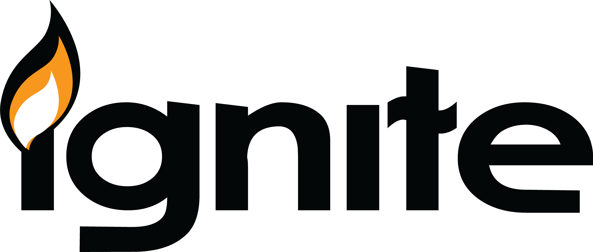

# Ignite

> Team Firewall's First CTF Production Project

## Team

jinyeong001(장진영)|[프로필 링크](https://github.com/jinyeong001)
JJH0204(정재호)|[프로필 링크](https://github.com/JJH0204)  
wlghd0280(김지홍)|[프로필 링크](https://github.com/wlghd0280)  
kporosl(최민제)|[프로필 링크](https://github.com/kporosl)  

## Guide

- 원활한 CTF 진행을 위해 필요한 몇 가지 준비 사항입니다.

### [WarGame](https://jjh0204.github.io/Ignite_CTF/)

- CTF에 참여하면서 해결해야 하는 도전과제들을 워게임 형식으로 풀이하는 사이트입니다.
- 가상머신의 취약점에 대한 힌트와 이야기를 제공하여 좀 더 즐겁게 풀이 하실 수 있도록 준비했습니다.
- 취약한 가상머신에서 획득한 플래그를 정답으로 입력하여 단계를 진행할 수 있습니다.

### [Install](https://drive.google.com/drive/folders/1kN6JC0rfAl4YPQi9hRmUYRtEzPgVmpD_?usp=sharing)

- 본 CTF 머신은 총 2개의 서브 CTF(가상머신)으로 구성되어 있습니다.
- 순차적으로 진행하는 것을 권장합니다.

### Setup

#### 1. VM

- 본 CTF 머신은 [Virtual Box](https://www.virtualbox.org/)을 활용해 개발했습니다.
- 사용자의 환경에 따라 Virtual Box 가 아닌 다른 VM 프로그램을 사용할 시 추가 환경 설정이 필요할 수 있습니다.

#### 2. Network

- 공격자(Kali)를 포함한 모든 CTF 머신은 동일한 네트워크에 설치되어야 합니다.
- 가상머신의 첫번째 네트워크 어뎁터는 Host Only Network(192.168.56.0/24)로 설정되어야 합니다.
- 그 외 추가 네트워크 설정을 자유롭게 설정하시면 됩니다.

#### 3. Other

- 그 외 다른 설정은 사용자의 편의대로 수정하시면 됩니다.
